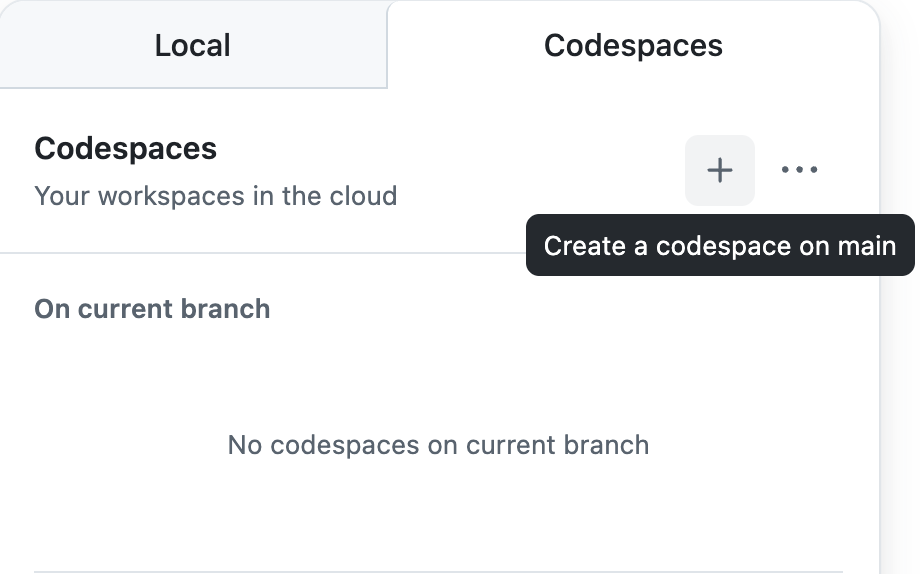

## じゃんけんゲーム
ランダムに生成される手とユーザが入力する手でじゃんけんを行うゲーム

***

## 演習について
Goという言語で実装していますが，なんとなくわかるような簡単なプログラムかつツッコミどころ満載なので，調べてみたり，生成AIに聞いてみたりして，いろんな観点で改善点を見つけて報告（issue） & コード変更・機能追加（PullRequest）に挑戦してみてください!

### 課題の例
いくつか例を示しますが，基本的にはじゃんけんとして機能していればなんでもありです．
- リファクタリング
  - 変数名やメソッド名の付け方の統一
  - 冗長な処理の簡略化
  - 可読性の向上
- 出力情報の追加・変更
- 機能追加
  - 第３の手の追加

※ わからないこと・気になることがあればTAに声をかけてください


## 実行方法（コードスペースの起動方法）
この文章が見えているページでキーボードの"."を押すか以下の手順で起動できます．
1. 右上の"<> Code"ボタンをクリック
2. 右側の"Codespaces"を選択
3. codespacesの"+"（Create a codespace on main）をクリック




## コミット・プッシュ・プルリクエストについて
コミットおよびプッシュ（コード変更）は **必ずブランチを作成してから** 行ってください
（codespace上でコミットを行う場合は，コミット時に表示される注意書きの， 新しいブランチにコミットする を押してください．ブランチを作成してから作業を行なっても問題ありません．ブランチ名は自由ですが"作業内容/氏名"を推奨します）

プルリクエストは，テンプレートを用意しているので，[Pull requeats](https://github.com/SocSEL-INFOseminar1-2025/rsp-game-go/pulls "rsp-game-go_pulls")から作成することを推奨します

マージ操作は行わないでください

## プログラム実行方法
```
// 実行プログラムがあるフォルダに移動
cd src
```

実行はどちらかでできます
- ビルドと実行を分ける（実行ファイルが生成される）
```
// ビルド
go build {実行ファイル名}.go
// 実行
./{実行ファイル名}
```

- ビルドと実行を同時に行う
```
go run {実行ファイル名}.go
```